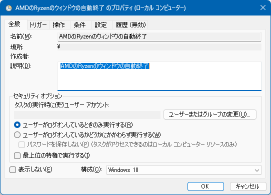

# AMD Software Adrenalin Edition を自動的に閉じる

「AMD Software Adrenalin Edition」がWindowsのロックを解除するタイミングで、なぜかウィンドウを広げてしまうので、  
その際に自動的にウィンドウを閉じるようにするためのツール。

## 使い方

### .exe をゲット

- Release 内の .zip を解凍じて、AMDSoftwareAdrenalinEditionAutoCloser.exe をどこか適当なディレクトリに配置
  （ご自身のツールなどのディレクトリなどわかりやすい、忘れないディレクトリに配置してください)
  https://github.com/komiyamma/AMDSoftwareAdrenalinEditionAutoCloser/releases/

### タスクスケジューラに登録

- タスクスケジューラを起動し、タスクの作成をクリック

- 適当にタスクに名前を付ける

- トリガーは、「ワークステーションのアンロック時」

- 実行するプログラムとして、「AMDSoftwareAdrenalinEditionAutoCloser.exe」を参照

## AMDSoftwareAdrenalinEditionAutoCloser は何をやってるの？

単純に「AMD Software Adrenalin Edition」のプロセスがあれば、これを終了させるだけです。